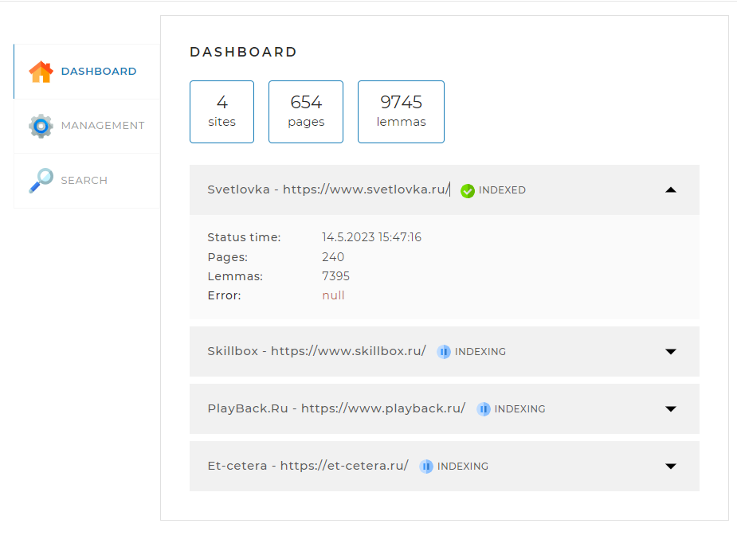
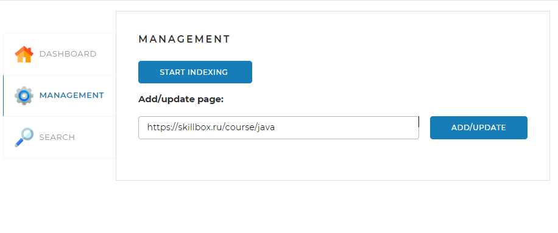
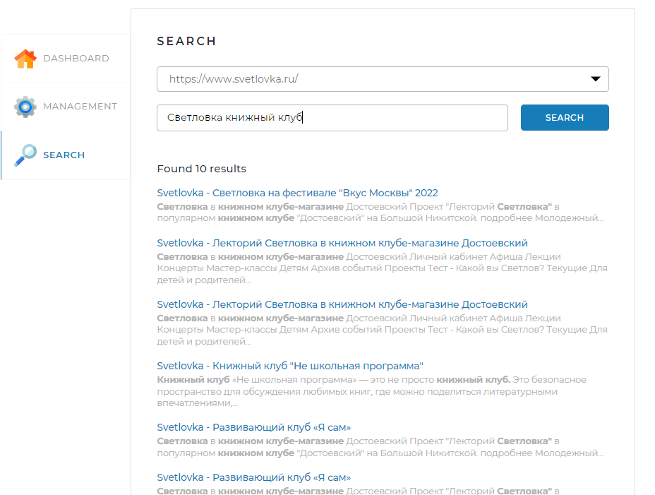

<h1 align="center">Search Engine</h1>
<p align="center">

</p>

Данный поисковый движок предназначен для быстрого поиска информации по запросу из поисковой строки по проиндексированным
сайтам.
При необходимости его можно установить на своем сервере или компьютере, которые предварительно содержат локально
установленную базу данных MySQL и осуществлять поиск по одному или нескольким требуемым сайтам.

## Эндпоинты проекта
http://localhost:8080/

1. _/api/statistics_ - метод возвращает служебную информацию о сотоянии поисковых индексов и самого движка

2. _/api/startIndexing_ - метод запускает индексацию/переиндексацию всех сайтов

3. _/api/stopIndexing_ - метод останавливет текущий процесс полной или частичной индексации/переиндексации

4. _/api/indexPage_ - метод создает/обновляет данные по странице, адрес которой передан в параметре

5. /api/search - мето осуществляе поиск страниц по переданному поисковому запросу

## Статистика

**Параметры:**
Метод без параметров

**Формат ответа:**

```
{
    'result': true,
    'statistics': {
        "total": {
             "sites": 10,
             "pages": 436423,
             "lemmas": 5127891,
              "indexing": true
        },
        "detailed": [
            {
            "url": "http://www.site.com",
            "name": "Имя сайта",
            "status": "INDEXED",
            "statusTime": 1600160357,
            "error": "Ошибка индексации: главная страница сайта недоступна",
            "pages": 5764,
            "lemmas": 321115
            },
        ...
        ]
    }
}
```

## Запуск полной индексации

**Параметры:**
Метод без параметров

**Формат ответа в случае успеха:**

```
{
    'result': true
}
```

**Формат ответа в случае ошибки:**

```
{
    'result': false,
    'error': "Индексация уже запущена"
}
```

Остановка текущей индексации

**Параметры:**
Метод без параметров

**Формат ответа в случае успеха:**

```
{
    'result': true
}
```

**Формат ответа в случае ошибки:**

```
{
    'result': false,
    'error': "Индексация не запущена"
}
```

## Добавление или обновление отдельной страницы

**Параметры:**

- url — адрес страницы, которую нужно переиндексировать.

**Формат ответа в случае успеха:**

```
{
    'result': true
}
```

**Формат ответа в случае ошибки:**

```
{
    'result': false,
    'error': "Данная страница находится за пределами сайтов, указанных в конфигурационном файле"
}
```

## Получение данных по поисковому запросу

**Параметры:**

- query — поисковый запрос;
- site — сайт, по которому осуществлять поиск (если не задан, поиск должен происходить по всем проиндексированным
  сайтам);
- offset — сдвиг от 0 для постраничного вывода (параметр необязательный; если не установлен, то значение по умолчанию
  равно нулю);
- limit — количество результатов, которое необходимо вывести (параметр необязательный; если не установлен, то значение
  по умолчанию равно 20).

**Формат ответа в случае успеха:**

```
{
    'result': true,
    'count': 574,
    'data': [
        {
        "site": "http://www.site.com",
        "siteName": "Имя сайта",
        "uri": "/path/to/page/6784",
        "title": "Заголовок страницы, которую выводим",
        "snippet": "Фрагмент текста, в котором найдены совпадения, <b>выделенные жирным</b>, в формате HTML",
        "relevance": 0.93362
        },
    ...
    ]
}
```

Формат ответа в случае ошибки:

```
{
    'result': false,
    'error': "Задан пустой поисковый запрос"
}
```

## Веб-интерфейс проекта.

Для удобства использования данного поискового движка предлагается веб-интерфейс с простым и понятным управлением,
который состоит из 3-х вкладок:

### **1. Dashboard**



Данная вкладка открывается по умолчанию. На ней
отображается общая статистика по всем индексируемым/проиндексируемым сайтам, а также
детальная статистика и статус по каждому из сайтов.
Возможные статусы, отображающиеся у сайтов:

- INDEXING - на данный момент у сайта запущена индексация/переиндексация или обновление определённой страницы.
- INDEXED - сайт полностью проиндексирован и готов к поиску
- FAILED - сайт не удалось проиндексировать (поиск невозможен до устранения ошибки или перезапуска индексации), в данном
  случае
  в выпадающем окне под сайтом указана ошибка в разделе Error.
  (статистика получается по API-запросу /api/statistics)

### **2. Management**



На данной вкладке находятся инструменты управления
поисковым движком — запуск полной индексации/переиндексации (кнопка START INDEXING) и ее
остановка (кнопка STOP INDEXING). Также, есть возможность добавить/обновить
отдельную страницу по ссылке, задав ее URL и нажав кнопку ADD/UPDATE.
Наличие или отсутствие закрывающего слеша (/) у URL никак не отразится на работе по
добавлению/обновлению страницы.
Если после обновления страницы с вкладки пропала кнопка остановки (STOP INDEXING), то необходимо еще раз нажать на
кнопку запуска
(START INDEXING), после чего кнопка остановки снова появится.
После нажатия кнопки остановки (STOP INDEXING) необходимо подождать некоторое время, чтобы программа корректно завершила
свою работу и
отобразила прерывание на вкладке Dashboard.

### **3. Search**



Данная вкладка предназначена для тестирования поискового
движка.
На ней находится выпадающий список с выбором диапазона поиска: о всем проиндексированным сайтам (All sites)
или по конкретному, выбрав его URl. Также, вкладка содержит поле для ввода поискового запроса (Query) и кнопку
запуска поиска (SEARCH). В случае удачного поиска будет выведен перечень результатов с подсвеченными поисковыми словами.

- Запуск поиска по конкретному сайту возможен в случае, если данный сайт проиндексирован, о чем может указать вкладка
  Dashboard.
- Запуск поиска по All sites возможен в случае завершения индексации всех сайтов.
  (Поиск осуществляется по API-запросу /api/search)

## Применяемые технологии

Поисковый движок представляет из себя Spring-приложении на платформе Spring Boot и сборщика Maven.
Необходимые зависимости прописанные в pom.xml:
<ul>
<li>
<b>spring-boot-starter-web</b> - подключает библиотеки, необходимые для выполнения Spring-MVC функций приложения.
</li>
<li>
<b>spring-boot-starter-thymeleaf </b>- движок шаблонов Java для обработки и создания HTML, XML, JavaScript, CSS и текста.
</li>
<li>
<b>spring-boot-starter-data-jpa </b>- предоставляет обширную поддержку для работы с базами данных SQL.
</li>
<li>
<b>jsoup</b> - позволяет проводить анализ анализа, извлечение и управление данными, хранящимися в документах HTML.
</li>
<li>
<b>mysql-connector-java </b>- подключает зависимость между СУБД MySQL и программой.
</li>
<li>
<b>hibernate-validator </b>- определяет модель метаданных и API для JavaBean, а также проверку метода.
</li>
<li>
<b>lombok </b>- библиотека сокращает код в классах и расширяет функциональность языка Java.
</li>
<li>
библиотека леммизации слов.
</li>
</ul>

## Запуск и настройка приложения

Предварительно перед началом работы с приложением необходимо установить JDK, среду разработки IntelliJ IDEA, фреймворк
Apache Maven и MySQL-сервер
если они еще не установлены. При установке MySQL-сервера внимательно отнеситесь к присвоенному паролю!

1. Загрузите на локальный диск репозиторий Search Engine расположенный по ссылке:  ссылка
2. Запустите проект в среде IntelliJ IDEA.
3. Запустите MySQL Workbench и создайте пустую базу данных **search_engine**.
   При использовании другого наименования, отразите его в файле _application.yaml_ параметр _spring:datasource:url_.
4. Заполните параметры _spring:datasource:username_ и _spring:datasource:password_ в файле _application.yaml_ на
   основании
   имени пользователя и пароля, которые вы задали при установке MySQL-сервера.
5. Запустите приложение в среде разрабоки IntelliJ IDEA и перейдите на локальный порт указанный
   в файле _application.yaml_ в параметре server.port (например http://localhost:8080/ при значении 8080)

Для определения сайтов, по которым будет проводится индексация и поиск, нужно заполнить данные
файла _application.yaml_, где указать в параметре _indexing-settings:sites_:
<ul>
<li>
<b>url</b> - адрес главной страницы сайта. (Например, https://www.skillbox.ru/)
</li>
<li>
<b>name </b>- имя сайта. Данной имя будет отображаться на вкладке Dashboard.
</li>
</ul>
После внесения изменений приложении необходимо перезапустить в IntelliJ IDEA.


